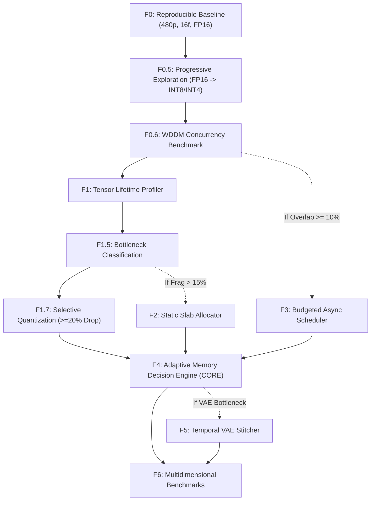

# Marley Runtime (`marley-runtime`) — Roadmap v5

**Release Date:** 2026-09-08  
**Status:** Active — Phase F0 COMPLETE · Phase F0.5 NEXT  
**Target Repository:** [`LARP/marley-runtime`](https://github.com/LARP/marley-runtime)  
**Primary Objective:** Investigate and deploy adaptive memory management policies for Wan2.1-T2V-1.3B constrained to ~4.8 GB effective physical VRAM (NVIDIA GeForce RTX 3050 6GB Laptop, Windows WDDM), prioritizing 480p resolution (with 720p as secondary/stretch milestone).

> **Phase F0 completed 2026-09-08T06:04:40Z.** First real Wan2.1-T2V-1.3B video generated at 480p/16f/FP16. Peak NVML: 5451 MB (gate exceeded by 651 MB in VAE decode). VAE confirmed as primary bottleneck — Phase F5 trigger pre-activated.

> **Provenance Note:** This roadmap represents the unified **v5 architectural consensus**, synthesized and hardened via a multi-agent review ensemble (ChatGPT, DeepSeek Pro, and Gemini Pro).

---

## 1. Guiding Principles

1. **Evidence Precedes Optimization:** No optimization phase is implemented without prior empirical profiling data.
2. **Strict Milestone Decoupling:** Memory residency feasibility and execution performance (speed/latency) are benchmarked and pursued independently.
3. **Explicit Kill Gates:** Every conditional phase defines objective, non-negotiable cancellation criteria before downstream investment.
4. **Falsifiable Hypotheses:** Every stage posits an explicit, testable hypothesis capable of being refuted by hardware telemetry.
5. **Early Quantization with Caution:** Quantization is evaluated early as an effective memory lever, strictly validated against output fidelity.
6. **Portability and Practical Utility:** Implementation focuses on clean, reproducible abstractions runnable on consumer hardware.
7. **Windows WDDM Environment Adaptation:** Asynchronous PCIe/compute concurrency is measured empirically under the WDDM driver scheduler before committing resources to an asynchronous transfer engine.

---

## 2. VRAM Budget Specification & Measurement

Under Windows Display Driver Model (WDDM), driver-level allocations, paging, and shared system memory can obfuscate true GPU pressure. To ensure rigorous, unambiguous accounting, memory is tracked across **three distinct telemetry layers**:

1. **`torch.cuda.memory_allocated()`**: Active byte footprint of live PyTorch tensors.
2. **`torch.cuda.memory_reserved()`**: Total memory pooled by the PyTorch caching allocator.
3. **Physical GPU Residency (NVML / `nvidia-smi`)**: Actual physical device memory occupied by the process at the hardware driver level.

> [!IMPORTANT]
> The strict **4.8 GB ceiling applies to Physical GPU Residency (NVML)**. This metric is the single ground-truth indicator of real hardware capacity under Windows WDDM. PyTorch allocated and reserved statistics serve as auxiliary diagnostics.

---

## 3. Phased Implementation Roadmap

---

### Phase F0 — Reproducible Baseline · 🟢 COMPLETE

**Completed:** 2026-09-08T06:04:40Z · Script: [`f0_baseline_real.py`](f0_baseline_real.py)

- **Goal:** Execute Wan2.1-T2V-1.3B in FP16 precision at 480p with 16 frames utilizing standard Diffusers pipeline offload.
- **Kill Gate:** PASS — 480p execution achieved with `enable_sequential_cpu_offload()`.

#### Measured Results

| Checkpoint | NVML Physical | PyTorch Alloc | Gate 4.8 GB |
| :--- | :---: | :---: | :---: |
| Idle / pre-load | 1261 MB | 0 MB | ✅ |
| Post-VAE load | 1287 MB | 0 MB | ✅ |
| Post-pipeline + offload | 1264 MB | 1 MB | ✅ |
| **Peak (VAE decode)** | **5451 MB** | 15.9 MB | ❌ +651 MB |

| Metric | Value |
| :--- | :--- |
| Resolution | 832×480 |
| Frames | 16 (`num_frames=17` recommended for future runs: `(17-1)%4=0`) |
| Denoising (30 steps) | 297s · 9.93 s/step |
| VAE decode | 322s (**primary bottleneck**) |
| Total wall-clock | 619.8s (~10.3 min) |
| OOM crash | None (WDDM paged the excess) |

> **Key finding:** The DiT denoising phase fits within the 4.8 GB gate comfortably. The entire VRAM excess (+4,187 MB) occurred during VAE decode. This confirms the **Phase F5 (Temporal VAE Stitcher) trigger** criterion is met empirically.

---

### Phase F0.5 — Progressive Configuration Exploration
- **Methodology (Sequential variable isolation):**
  1. **FP16 Baseline Envelope:** Determine maximum resolution and frame count achievable with FP16 and standard offload without exceeding 4.8 GB physical residency.
  2. **Precision Scaling:** Benchmark INT8 and INT4 quantization on top of the established FP16 configuration, measuring impact on physical VRAM, generation latency, and reconstruction quality.
  3. **Offload Strategies:** Evaluate CPU offload vs model CPU offload permutations only where necessary.
- **Metrics:** Peak physical VRAM (NVML), host system RAM, wall-clock inference time, image/frame fidelity (PSNR/SSIM), and exact OOM threshold.
- **Kill Gate:** If quantization fails to reduce total peak physical VRAM by at least **20%** without severe visual degradation, discard the quantization branch.

---

### Phase F0.6 — Windows WDDM Concurrency Evaluation
- **Benchmark:** Measure effective hardware overlap of `cudaMemcpyAsync` host-to-device transfers alongside dense matrix multiplication kernels (`matmul`) operating on separate non-default CUDA streams.
- **Kill Gate:** If measured transfer/compute overlap under WDDM is **< 10%**, permanently cancel Phase F3 (asynchronous prefetch scheduler) in favor of deterministic synchronous staging.

---

### Phase F1 — Tensor Lifetime Profiler
- **Goal:** Trace lifecycle events (allocation, utilization, deallocation) and per-component peak residency across DiT layers, text encoders, and VAE.
- **Boundary Handling:** Custom compiled or attention kernels that hide explicit allocation calls will be bounded by NVML hardware sampling.
- **Kill Gate:** If fine-grained dynamic profiling proves intractable due to runtime overhead or driver virtualization, fall back to static analytical memory modeling.

---

### Phase F1.5 — Real Bottleneck Identification
- **Decomposition:** Quantify memory consumption by category:
  - Static Model Weights
  - DiT Self-Attention and Cross-Attention Activations
  - VAE Latent Up-sampling / Decoding
  - Memory Allocator Fragmentation
  - Host-to-Device Prefetch Buffers
- **Deliverable:** Prioritized roadmap dispatch directing phases F1.7, F2, and F3.

---

### Phase F1.7 — Selective & Adaptive Quantization
- **Goal:** Lower peak physical VRAM residency by **≥ 20%** through selective quantization applied to non-critical weight blocks and projection layers.
- **Kill Gate:** If selective quantization cannot achieve a **≥ 20% net reduction** in physical VRAM or introduces perceptual artifacts, abandon selective quantization.

---

### Phase F2 — Static Slab Allocator *(Conditional)*
- **Trigger:** Activated strictly if memory allocator fragmentation or caching overhead accounts for **> 15%** of the 4.8 GB VRAM budget during Phase F1.5 profiling.
- **Goal:** Replace PyTorch dynamic memory caching with a fixed ring-buffer slab allocator for predictable, zero-fragmentation forward passes.
- **Kill Gate:** If the custom allocator produces no measurable reduction in peak physical VRAM, discard it.

---

### Phase F3 — Budgeted Asynchronous Scheduler *(Conditional)*
- **Trigger:** Activated only if Phase F0.6 demonstrates **≥ 10% overlap** under WDDM and Phase F1.5 confirms that double-buffered prefetching does not inflate peak residency past the 4.8 GB boundary.
- **Goal:** Overlap PCIe weight streaming with preceding block DiT compute using dedicated CUDA streams.
- **Kill Gate:** If compute/transfer overlap drops below **5%** or triggers driver-level paging/OOM, revert immediately to synchronous execution.

---

### Phase F4 — Adaptive Memory Decision Engine *(CORE SYSTEM)*
- **Granularity:** Operates at the **block/layer granularity**, avoiding per-tensor scheduling overhead.
- **Decision Formulation:** Built on analytical cost profiles (PCIe bandwidth, layer compute throughput), updated via lightweight runtime observations:
  - Current free physical VRAM headroom
  - Recent PCIe transfer latency
  - Layer compute elapsed time
  - Exponential moving average of system memory pressure
- **Execution Model:** Ahead-Of-Time (AOT) static plan generated following Step 1 warmup, with periodic re-evaluation checkpoints every $N$ diffusion steps or upon abrupt memory pressure deviations.
- **Kill Gate:** If the adaptive engine does not outperform the best static baseline policy by at least **5%** in memory headroom or execution speed, simplify to a fixed policy.

---

### Phase F5 — Temporal VAE Stitcher *(Conditional, Low Priority)*
- **Trigger:** Activated only if the VAE decoding pass is identified in Phase F1.5 as the primary OOM bottleneck and layer offloading fails to contain it.
- **Goal:** Chunked temporal latent decoding with overlapping frame blending to decode long sequences within memory limits.
- **Kill Gate:** If the stitcher does not save **≥ 20% VRAM** during decoding or creates noticeable boundary seam artifacts, cancel implementation.

---

### Phase F6 — Multidimensional Benchmarks & Verification
- **Target Workload:** Wan2.1-T2V-1.3B at **480p, 33 frames** (Primary target); 720p evaluation as secondary stretch capability.
- **Evaluation Dimensions:**
  1. Peak physical VRAM residency (NVML)
  2. Total wall-clock generation time
  3. Spatial reconstruction fidelity (PSNR / SSIM)
  4. Temporal coherence (Warp error / Fréchet Video Distance)
  5. Policy adaptation responsiveness under varying external VRAM load
- **Success Criteria Milestones:**
  - **Milestone A:** $\le 4.8\text{ GB}$ physical GPU residency without Out-Of-Memory exceptions.
  - **Milestone B:** End-to-end generation time $< 10\text{ minutes}$ (or competitive with baseline low-VRAM sequential offload).
  - **Milestone C:** Free of perceptual visual degradation and severe temporal jitter.
  - **Milestone D:** Dynamic policy switching demonstrated when external VRAM pressure is injected.

---

## 4. Kill Gates Summary Table

| Phase | Phase Name | Activation Condition | Kill Gate / Cancellation Trigger | Fallback Path |
| :--- | :--- | :--- | :--- | :--- |
| **F0** | Baseline Pipeline | Unconditional | Cannot run 480p/16f with baseline offload | Re-scope model architecture / target |
| **F0.5** | Progressive Configs | Unconditional | Quantization fails to reduce peak VRAM $\ge 20\%$ | Discard quantization track |
| **F0.6** | WDDM Concurrency | Unconditional | PCIe/Compute overlap $< 10\%$ under WDDM | Discard Phase F3 (Async Scheduler) |
| **F1** | Lifetime Profiler | Unconditional | Dynamic tracing too intrusive / infeasible | Static analytical memory estimation |
| **F1.5** | Bottleneck Analysis | Unconditional | Unclassifiable allocations | Global black-box residency bounds |
| **F1.7** | Selective Quantization | Evaluated in F0.5/F1.5 | Net physical VRAM drop $< 20\%$ or severe artifacts | Retain original numerical precision |
| **F2** | Slab Allocator | Allocator fragmentation $> 15\%$ | No measurable peak physical VRAM drop | Retain standard PyTorch caching allocator |
| **F3** | Async Scheduler | F0.6 overlap $\ge 10\%$ & prefetch safe | Overlap $< 5\%$ or causes OOM under load | Synchronous layer transfer |
| **F4** | Adaptive Decision Engine | Unconditional (Core) | Fails to beat best static policy by $\ge 5\%$ | Deterministic static block policy |
| **F5** | Temporal VAE Stitcher | VAE is confirmed bottleneck | Saves $< 20\%$ VRAM or introduces seam artifacts | Tiled spatial decoding fallback |
| **F6** | Verification Benchmarks | Completion of prior phases | Wall-clock time $> 30\text{ min}$ without explanation | Document operational boundaries |

---

## 5. Architectural & Execution Highlights

- **Resolution Hierarchy:** **480p** is the non-negotiable primary benchmark target; 720p is an experimental exploration attempted only if 480p meets all milestones with comfortable margin.
- **Physical Residency Primacy:** All memory gates evaluate total process physical GPU residency via NVML, not solely internal PyTorch allocation graphs.
- **Core Priority:** Phase F4 (Adaptive Memory Decision Engine) is the technical heart of `marley-runtime`; all preceding phases serve to measure, calibrate, or supply primitives to this decision engine.

---

*Marley Runtime is dedicated in loving memory to Marley 🐾.*
