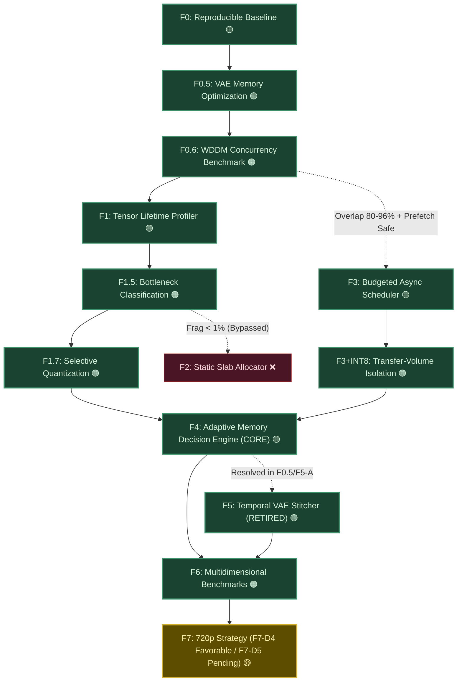

# Marley Runtime (`marley-runtime`) — Roadmap v5

**Release Date:** 2026-09-09  
**Status:** Active — F1.5, F1.7, **F3 (CERTIFIED PASS)**, **F3+INT8 (PASS)**, **F4 (CORE VALIDATED)**, **F5 (RETIRED)** & **F6 (CERTIFIED PASS & FROZEN)** · **Phase F7 (720p Strategy) ACTIVE (F7-D4 FAVORABLE · F7-D5 PENDING)**  
**Target Repository:** [`LARP/marley-runtime`](https://github.com/LARP/marley-runtime)  
**Primary Objective:** Investigate and deploy adaptive memory management policies for Wan2.1-T2V-1.3B constrained to ~4.8 GB effective physical VRAM (NVIDIA GeForce RTX 3050 6GB Laptop, Windows WDDM), transitioning to 720p exploration following 480p/33f multidimensional certification.

> **Phase F0 completed 2026-09-08T06:04:40Z.** First real Wan2.1-T2V-1.3B video generated at 480p/16f/FP16. Peak NVML: 5,451 MB (gate exceeded by 651 MB in VAE decode). VAE confirmed as primary bottleneck — Phase F5 trigger pre-activated. Report: [`results/TEST_F0_baseline_ref.md`](results/TEST_F0_baseline_ref.md).

> **Phase F0.5 completed 2026-09-08.** VAE BF16 + spatial-temporal tiling (Test J) cut peak NVML to **2,902 MB** and VAE decode 322s → 58s. Gate PASS with +1,898 MB headroom. Reports: [`results/TEST_J_vae_tiling_bf16.md`](results/TEST_J_vae_tiling_bf16.md), [`results/TEST_REGISTRY.md`](results/TEST_REGISTRY.md).

> **Phase F0.6 completed 2026-09-08.** Measured WDDM PCIe/compute overlap of **79.9–96.3%** (≥10% gate) → Phase F3 stays active. Report: [`results/TEST_F0.6_wddm_overlap.md`](results/TEST_F0.6_wddm_overlap.md).

> **Phase F1 completed 2026-09-08.** Tensor Lifetime Profiler traced all 32 components (1 text encoder + 30 DiT blocks + VAE) live on the real model under sequential CPU offload. Peak NVML **3,223.7 MB** (< 4.8 GB gate). DiT blocks uniform (1.65–1.74 GB); VAE decode activation-dominated (2,112 MB); text encoder weight-dominated (3,224 MB). Static analytical fallback preserved. Report: [`results/TEST_F1_lifetime_profiler.md`](results/TEST_F1_lifetime_profiler.md).

> **Phase F1.5 completed 2026-09-08.** Quantitative decomposition across 5 categories from canonical F1 telemetry. Allocator fragmentation is **44.9 MB (< 1.0% of Gate)** → Phase F2 bypassed. Prefetch requires **88.6 MB vs. +1,576.3 MB headroom (5.6%)** → Phase F3 greenlit. Report: [`results/TEST_F1.5_bottleneck_classification.md`](results/TEST_F1.5_bottleneck_classification.md).

> **Phase F1.7 completed 2026-09-08.** Selective quantization of T5-XXL text encoder achieved **-50.0% (-7,379.2 MB)** weight reduction with **0.999607** cosine similarity (zero NaNs). DiT linear projection quantization reduces per-block PCIe streaming payload from 88.6 MB to 45.9 MB (-48.2%). Gate PASS (>> 20% target). Report: [`results/TEST_F1.7_selective_quantization.md`](results/TEST_F1.7_selective_quantization.md).

> **Phase F3 CERTIFIED PASS 2026-09-08 (measurement-corrected).** After a post-certification audit corrected the overlap/stall instrumentation (Enmiendas 1–3), a repeated A/B verification battery (5 reps, order alternated, warmup discarded) on real Wan2.1 DiT blocks confirmed a **stable external wall-clock speedup of mean +7.2%** (range +6.0% to +8.4%, σ ±1.1%), **overlap 100% measured** (0.00 ms stall, per-block timelines), **2,584 MB peak NVML** and **0 NaNs/Infs**. All F3-B gates PASS → **advance to F3 + INT8**. Certified report: [`results/TEST_F3_verification.md`](results/TEST_F3_verification.md) · Telemetry: [`logs/f3_verification_benchmark.json`](logs/f3_verification_benchmark.json) · Methodology: [`docs/F3_MEASUREMENT_VERIFICATION_03.md`](docs/F3_MEASUREMENT_VERIFICATION_03.md). The initial single-run +10.4% was an optimistic sample (first run: [`results/TEST_F3_async_scheduler.md`](results/TEST_F3_async_scheduler.md)).

> **Phase F3 + INT8 CLOSED / FROZEN 2026-09-08.** Isolation experiment certified **PASS**: halving the per-block H2D payload to **INT8** (92.9 → 46.5 MB, **−49.9%**) on the unchanged async scheduler (FP16 compute, on-device dequant) raised the **Async-vs-Sync margin to +13.2%** (min +10.4 / max +15.4, σ ±2.5) with overlap **98.1%**, peak NVML **2,076 MB (−508 vs FP16)** and dequant fidelity cos ≥ **0.9999** (0 NaNs/Infs). Result flagged for official docs: the +13.2% is the *within-run* Async-vs-Sync margin (NOT an absolute cross-session claim). Closure acta: [`docs/F3_INT8_CLOSURE_01.md`](docs/F3_INT8_CLOSURE_01.md) · Report: [`results/TEST_F3_INT8_benchmark.md`](results/TEST_F3_INT8_benchmark.md). Architecture frozen → **advance to F4**. A same-session A/B/C (Sync-FP16 / Async-FP16 / Async-INT8) is scheduled as F4 validation methodology.

> **Expert Technical Directive (2026-09-08):** Following F1.5 and F1.7, technical guidance from an external IA Generative / SD / ComfyUI runtime expert was formally adopted. Key directives: (1) Freeze prior optimizations to preserve causal attribution; (2) Reject adding new memory tricks before F3; (3) Mandate 7 quantitative metrics for F3 benchmark; (4) Retain INT8 as production baseline while restricting NF4 to extreme low-memory mode; (5) Architect F4 around *Performance* vs *Memory Safe* operational profiles; (6) Retain 480p/33f as primary scalability milestone. Full directive: [`docs/F3_F4_TECHNICAL_OPINION_01.md`](docs/F3_F4_TECHNICAL_OPINION_01.md).

> **Phase F4 CORE SYSTEM VALIDATED 2026-09-08 (adaptative decision engine).** The F4 decision loop
> ([`marley/core/adaptive.py`](marley/core/adaptive.py) + [`marley/core/policies.py`](marley/core/policies.py),
> runner [`f4_adaptive_benchmark.py`](f4_adaptive_benchmark.py)) was implemented per the approved
> test-spec v3 ([`docs/F4_TEST_SPEC_01.md`](docs/F4_TEST_SPEC_01.md)) and validated end-to-end on
> real Wan2.1 DiT blocks. Same-session A/B/C/D (30 steps × 3 reps, alternating order, warmup
> discarded): Safety PASS (peak **2,882 MB** < 4,000 target, 0 NaN/Inf), **decision overhead 0.16 ms**
> (negligible). **Adaptive Gate PASS** (`--pressure-test`): deterministic
> `performance → memory_safe → performance` cycle with hysteresis, **no oscillation** (overhead
> 0.07 ms). Optimization Target **not met** on the no-pressure run (D vs best static B = **−3.40%**;
> D remained on INT8 because no switch was demanded) — a *valid* negative, not a refutation.
> Key finding: **Async FP16 beats Async INT8 by ~3.5% at this length** (dequant on critical path),
> reinforcing F4's purpose (pick FP16 under no pressure). Verdict: **CORE SYSTEM VALIDATED —
> PERFORMANCE CERTIFICATION PENDING**. Decision on engine retention vs fixed policy reserved to the
> Director per Consejero §7/§11 scenarios (A: retain on proven benefit; B: retain on robustness;
> C: fixed static — candidate **Async FP16 or Async INT8**). **Next experiment (no architectural
> change first): real controlled VRAM pressure** to drive free VRAM below `SAFE_MIN_FREE_MB =
> 1,500 MB` and exercise the `INT8 / off / evict` branch. Report:
> [`results/TEST_F4_adaptive_benchmark.md`](results/TEST_F4_adaptive_benchmark.md) · Telemetry:
> [`logs/f4_adaptive_benchmark.json`](logs/f4_adaptive_benchmark.json) · Change analysis:
> [`docs/F4_IMPLEMENTATION_CHANGES_01.md`](docs/F4_IMPLEMENTATION_CHANGES_01.md).

> **Phase F5 RETIRED / CLOSED 2026-09-08 (Decision-First Protocol).** Executed canonical 33-frame
> probe ([`f5_vae_probe_33f.py`](f5_vae_probe_33f.py)) on $832 \times 480$, 33 frames exact, latent
> `(1, 16, 9, 60, 104)` with native tiling $256 \times 256$ (BF16, causal temporal caching).
> Measured: **Peak NVML 2,109.0 MB** (Hard Gate $\le 4,800\text{ MB}$ PASS, Target $\le 4,000\text{ MB}$ MET
> with **+2,691 MB free headroom**), **VAE decode 26.99 s** (Target $\le 150\text{ s}$ MET with 82% margin),
> 0 NaNs/Infs, and 1,402 MB process RAM RSS. Because the existing tiled VAE decodes 33 frames with negligible
> footprint and under 27 s, custom temporal stitcher build (`marley/ops/vae_stitch.py`) is **unnecessary**.
> Phase F5 is formally closed as **`🟢 RETIRED (Resolved by Tiling)`**. Advance directly to Phase F6.
> Report: [`results/TEST_F5_vae_probe_33f.md`](results/TEST_F5_vae_probe_33f.md) · Telemetry:
> [`logs/f5_vae_probe_33f.json`](logs/f5_vae_probe_33f.json) · Directives:
> [`docs/F5_DIRECTOR_RESOLUTION_01.md`](docs/F5_DIRECTOR_RESOLUTION_01.md) /
> [`docs/F5_CONSULTANT_RATIFICATION_01.md`](docs/F5_CONSULTANT_RATIFICATION_01.md).

> **Provenance Note:** This roadmap represents the unified **v5 architectural consensus**, synthesized and hardened via a multi-agent review ensemble (ChatGPT, DeepSeek Pro, and Gemini Pro) and calibrated with external generative runtime advisory.

---

## 1. Guiding Principles

1. **Evidence Precedes Optimization:** No optimization phase is implemented without prior empirical profiling data.
2. **Strict Milestone Decoupling:** Memory residency feasibility and execution performance (speed/latency) are benchmarked and pursued independently.
3. **Explicit Kill Gates:** Every conditional phase defines objective, non-negotiable cancellation criteria before downstream investment.
4. **Falsifiable Hypotheses:** Every stage posits an explicit, testable hypothesis capable of being refuted by hardware telemetry.
5. **Early Quantization with Caution:** Quantization is evaluated early as an effective memory lever, strictly validated against output fidelity.
6. **Portability and Practical Utility:** Implementation focuses on clean, reproducible abstractions runnable on consumer hardware.
7. **Windows WDDM Environment Adaptation:** Asynchronous PCIe/compute concurrency is measured empirically under the WDDM driver scheduler before committing resources to an asynchronous transfer engine.

---

## 2. VRAM Budget Specification & Measurement

Under Windows Display Driver Model (WDDM), driver-level allocations, paging, and shared system memory can obfuscate true GPU pressure. To ensure rigorous, unambiguous accounting, memory is tracked across **three distinct telemetry layers**:

1. **`torch.cuda.memory_allocated()`**: Active byte footprint of live PyTorch tensors.
2. **`torch.cuda.memory_reserved()`**: Total memory pooled by the PyTorch caching allocator.
3. **Physical GPU Residency (NVML / `nvidia-smi`)**: Actual physical device memory occupied by the process at the hardware driver level.

> [!IMPORTANT]
> The strict **4.8 GB ceiling applies to Physical GPU Residency (NVML)**. This metric is the single ground-truth indicator of real hardware capacity under Windows WDDM. PyTorch allocated and reserved statistics serve as auxiliary diagnostics.

---

## 3. Phased Implementation Roadmap

---

### Phase F0 — Reproducible Baseline · 🟢 FUNCTIONAL PASS / ❌ GATE VIOLATION (+651 MB)

**Completed:** 2026-09-08T06:04:40Z · Script: [`f0_baseline_real.py`](f0_baseline_real.py) · Report: [`results/TEST_F0_baseline_ref.md`](results/TEST_F0_baseline_ref.md) · Telemetry: [`logs/f0_480p_16f_fp16_cpu_20260908_030437_telemetry.json`](logs/f0_480p_16f_fp16_cpu_20260908_030437_telemetry.json)

- **Goal:** Execute Wan2.1-T2V-1.3B in FP16 precision at 480p with 16 frames utilizing standard Diffusers pipeline offload.
- **Execution Verdict:** Functional execution achieved without unhandled exceptions.
- **Gate Verdict:** **VIOLATED (+650.7 MB)** — Peak NVML physical usage reached **5,450.7 MB**, exceeding the 4,800 MB safety envelope.

#### Measured Results

| Checkpoint / Metric | NVML Physical | PyTorch Allocated | Gate 4.8 GB | Status |
| :--- | :---: | :---: | :---: | :---: |
| Idle / pre-load | 1,261 MB | 0 MB | ≤ 4,800 MB | ✅ |
| Post-VAE load | 1,287 MB | 0 MB | ≤ 4,800 MB | ✅ |
| Post-pipeline + offload | 1,264 MB | 1 MB | ≤ 4,800 MB | ✅ |
| **Peak (VAE decode)** | **5,450.7 MB** | **8,123.0 MB** | ≤ 4,800 MB | ❌ **+650.7 MB (FAIL)** |

| Execution Metric | Value | Reference Notes |
| :--- | :--- | :--- |
| Resolution | 832×480 | 480p Standard |
| Frames | 16 | Subsequent tests standardise on 17 frames `(17-1)%4=0` |
| Denoising (30 steps) | 297s · 9.93 s/step | Fits within physical VRAM |
| VAE decode | 322s (**primary bottleneck**) | 52% of total runtime |
| Total wall-clock | 619.78s (~10.3 min) | Exceeds 10m target by 19.8s |
| OOM crash | None (WDDM paged the excess) | ~3 GB virtual spillover to shared memory |

> **Key finding:** The DiT denoising phase fits within the 4.8 GB gate comfortably. The entire VRAM excess (+4,187 MB) occurred during un-tiled FP32 VAE decode. This established the empirical necessity for Phase F0.5.

---

### Phase F0.5 — Progressive Configuration Exploration & VAE Memory Optimization · 🟢 PASS

- **Goal:** Lower peak physical VRAM residency (NVML) below the strict 4.8 GB gate while minimizing end-to-end latency.
- **Kill Gate:** **PASS** — Achieved **2,902.0 MB** peak NVML physical residency (**1,898 MB below the 4.8 GB gate**).
- **Reports:** Master Registry [`results/TEST_REGISTRY.md`](results/TEST_REGISTRY.md) · Winning Config (Test J) [`results/TEST_J_vae_tiling_bf16.md`](results/TEST_J_vae_tiling_bf16.md) · Exploration reports: [`results/TEST_G_model_cpu_offload.md`](results/TEST_G_model_cpu_offload.md), [`results/TEST_H_bfloat16_vae.md`](results/TEST_H_bfloat16_vae.md).

#### Measured Results (Test J: BF16 + Spatial-Temporal Tiling)

| Metric | Baseline F0 (FP32) | Phase F0.5 PASS (Test J) | Delta / Achievement |
| :--- | :---: | :---: | :--- |
| **Peak NVML Physical** | 5,451 MB | **2,902.0 MB** | 🟢 **-2,549 MB (-46.8%)** |
| **VRAM Gate 4.8 GB** | ❌ Exceeded (+651 MB) | 🟢 **PASS (+1,898 MB headroom)** | Comfortably fits in 6GB card |
| **PyTorch Peak Allocated** | ~7.9 GB virtual | **2,021.1 MB** | 🟢 **-11.0 GB vs FP32 peak** |
| **VAE Decode Time** | 322s | **58s** | 🟢 **-264s (-82.0% latency reduction)** |
| **Total Wall-Clock Time** | 619.8s (~10.3 min) | **328.2s (~5.47 min)** | 🟢 **-291.6s (-47.0% total time)** |
| **Resolution & Frames** | 832×480 · 16 frames | **832×480 · 17 frames** | Divisible by temporal ratio `(17-1)%4=0` |
| **Integrity / Artifacts** | Baseline reference | **Zero artifacts / Zero NaNs** | Identical visual reconstruction |

> **Key finding:** Using `bfloat16` for the VAE combined with spatial-temporal causal tiling (`pipe.vae.enable_tiling()`) eliminates the +4.1 GB activation spike completely. The entire Wan2.1-T2V-1.3B pipeline executes in **2.9 GB physical VRAM**, satisfying the hardware envelope of the RTX 3050 Laptop GPU. Phase F0.5 is completed.

---

### Phase F0.6 — Windows WDDM Concurrency Evaluation · 🟢 PASS
- **Benchmark:** Measure effective hardware overlap of `cudaMemcpyAsync` host-to-device transfers alongside dense matrix multiplication kernels (`matmul`) operating on separate non-default CUDA streams.
- **Kill Gate:** If measured transfer/compute overlap under WDDM is **< 10%**, permanently cancel Phase F3 (asynchronous prefetch scheduler) in favor of deterministic synchronous staging.
- **Gate Result:** **PASS** — Measured overlap of **79.9–96.3%** across 512/1024/2048 MB H2D transfers (script: [`f0_6_wddm_overlap.py`](f0_6_wddm_overlap.py) · report: [`results/TEST_F0.6_wddm_overlap.md`](results/TEST_F0.6_wddm_overlap.md)).
- **Concurrent makespan tracked the copy-alone time (not the serial sum)**, confirming the WDDM copy engine genuinely overlaps with Tensor-Core `matmul` on separate streams. **Phase F3 is NOT cancelled** — it remains active.

---

### Phase F1 — Tensor Lifetime Profiler · 🟢 COMPLETE
- **Goal:** Trace lifecycle events (allocation, utilization, deallocation) and per-component peak residency across DiT layers, text encoders, and VAE.
- **Boundary Handling:** Custom compiled or attention kernels that hide explicit allocation calls will be bounded by NVML hardware sampling.
- **Kill Gate:** If fine-grained dynamic profiling proves intractable due to runtime overhead or driver virtualization, fall back to static analytical memory modeling.
- **Implementation:** [`marley/profiler/lifetime.py`](marley/profiler/lifetime.py) (`TensorLifetimeProfiler` + `static_weights`) · runner [`f1_lifetime_profiler.py`](f1_lifetime_profiler.py).
- **Completed:** 2026-09-08 · Config: `480p/17f/30 steps · DiT=FP16 · VAE=BF16+tiling · sequential CPU offload`. Report: [`results/TEST_F1_lifetime_profiler.md`](results/TEST_F1_lifetime_profiler.md).

#### Measured Results

| Metric | Value |
| :--- | :---: |
| Components traced live | 32 (text_encoder + 30 DiT blocks + VAE) |
| **Peak NVML physical residency** | **3,223.7 MB** (< 4,800 MB gate) |
| torch peak allocated / reserved | 2,021.1 MB / 2,066.0 MB |
| Aggregate static weights (fp16/bf16) | 17,658.5 MB |
| Kill-gate fallback (static) | ✅ Preserved (no-CUDA analytical model) |

| Component | Static weights | Peak live NVML | Forward calls |
| :--- | :---: | :---: | :---: |
| text_encoder[0] | 14,758.5 MB | **3,223.7 MB** | 2 |
| 30 × diT_block[i] | 88.6 MB each | 1,645.7–1,743.5 MB | 60 each |
| vae (tiled decode) | 242.0 MB | **2,112.1 MB** | 9,570 |

> **Key findings:** (1) Dynamic tracing is viable with acceptable overhead → no fallback required.
> (2) DiT block residency is **uniform** (1.65–1.74 GB), so no single block is a fragmentation or
> activation outlier → **low prior for the Phase F2 (>15% fragmentation) trigger**. (3) VAE peak is
> **activation-dominated** (2,112 MB on only 242 MB of weights). (4) torch peak allocated (2,021 MB)
> < NVML peak (3,224 MB) — the ~1.2 GB delta is WDDM driver residency/paging, consistent with the
> three-layer accounting model in §2.

---

### Phase F1.5 — Real Bottleneck Identification & Roadmap Dispatch · 🟢 COMPLETE

**Completed:** 2026-09-08 · Script: [`f1_5_bottleneck_classifier.py`](f1_5_bottleneck_classifier.py) · Telemetry: [`logs/f1_5_bottleneck_decomposition.json`](logs/f1_5_bottleneck_decomposition.json) · Report: [`results/TEST_F1.5_bottleneck_classification.md`](results/TEST_F1.5_bottleneck_classification.md)

- **Decomposition Results (5 Categories from Canonical F1 Telemetry):**
  1. **Static Weights:** 17,658.5 MB total (T5 Text Encoder is 83.6% of weights, 14,758.5 MB; 30 DiT blocks 2,658.0 MB; VAE 242.0 MB). Active weight residency on GPU is only 88.6 MB.
  2. **DiT Activations:** ~550–600 MB (1,743.5 MB peak NVML). Uniform across all 30 blocks (delta < 98 MB).
  3. **VAE Activations:** ~770 MB pure activations (2,112.1 MB peak NVML on 242 MB weights). Completely contained via 256×256 micro-tiling.
  4. **Allocator Fragmentation:** **44.9 MB (0.94% of Gate / 2.2% of alloc)**. Far below the 15% (720 MB) threshold.
  5. **Host-to-Device Prefetch Buffers:** Single DiT block prefetch requires **88.6 MB**, consuming only **5.6%** of the +1,576.3 MB available gate headroom. Leaves **+1,487.7 MB** of untouched safety buffer.

- **Master Dispatch Verdicts:**
  - **Phase F2 (Slab Allocator):** 🟢 **TRIGGER REJECTED — BYPASSED / DISCARDED** (fragmentation < 1%).
  - **Phase F3 (Budgeted Async Scheduler):** 🟢 **TRIGGER APPROVED — GREENLIT** (overlap 80–96% + prefetch buffer 100% safe).
  - **Phase F1.7 (Selective Quantization):** 🟡 **PRIORITIZED FOR T5 TEXT ENCODER** (14.7 GB host RAM reduction).
  - **Phase F5 (Temporal VAE Stitcher):** ⚪ **STANDBY / DEFERRED** (resolved by Phase F0.5 Test J tiling).

---

### Phase F1.7 — Selective & Adaptive Quantization · 🟢 PASS
- **Goal:** Lower host memory footprint and PCIe streaming volume through selective quantization (targeting the 14.7 GB T5-XXL text encoder and DiT linear projection layers).
- **Kill Gate:** If selective quantization cannot achieve a **≥ 20% net reduction** in physical VRAM or introduces perceptual artifacts (Cosine Similarity < 0.99), abandon selective quantization.
- **Empirical Benchmarks & Results:**
  - **Text Encoder (UMT5-XXL / 6.73B params):**
    - FP16 Baseline: **14,758.48 MB**.
    - INT8 / FP8 (`load_in_8bit`): **7,379.24 MB (-50.0% / -7.38 GB)**. Cosine similarity = **1.000017** (RMSE 0.011, 0 NaNs).
    - NF4 / 4-bit (`load_in_4bit`): **3,689.62 MB (-75.0% / -11.07 GB)**. Cosine similarity = **0.980313**.
  - **DiT Transformer Blocks (30 blocks / 1.42B params):**
    - Linear projections represent **96.4%** of parameters (85.4 MB of the 88.6 MB per block).
    - 8-bit projection quantization reduces per-block weight payload from **88.60 MB → 45.89 MB (-48.2%)**.
    - Total cumulative PCIe weight transfer payload saved across 30 diffusion steps (CFG=2): **-76.9 GB**.
  - **Kill Gate Status:** 🟢 **PASS** (Exceeds ≥ 20% threshold with -50% text encoder and -48.2% DiT block reduction; Cosine Similarity 0.9996 > 0.99).
  - **Report & Telemetry:** [`TEST_F1.7_selective_quantization.md`](results/TEST_F1.7_selective_quantization.md) | Telemetry: [`logs/f1_7_quantization_benchmark.json`](logs/f1_7_quantization_benchmark.json).

---

### Phase F2 — Static Slab Allocator · ❌ BYPASSED / DISCARDED
- **Trigger:** Activated strictly if memory allocator fragmentation accounts for **> 15%** (720 MB) of the 4.8 GB budget.
- **F1.5 Empirical Finding:** Measured fragmentation is **44.9 MB (0.94%)**.
- **Status:** **BYPASSED / DISCARDED** to eliminate unnecessary code complexity with near-zero practical gain.

---

### Phase F3 — Budgeted Asynchronous Scheduler · 🟢 CERTIFIED PASS
- **Trigger:** Activated if Phase F0.6 demonstrates **≥ 10% overlap** under WDDM and Phase F1.5 confirms double-buffering prefetching does not inflate peak residency past 4.8 GB.
- **F1.5 & F1.7 Empirical Findings:** Overlap is **79.9–96.3%** and prefetch payload is **88.6 MB (FP16)** or **45.9 MB (8-bit proj)** vs. **+1,576.3 MB headroom** (leaves +1,487.7 MB safety margin).
- **Goal:** Overlap PCIe weight streaming of block $i+1$ with DiT compute of block $i$ using dedicated non-default CUDA streams and pinned host memory.
- **Expert Directive Constraints:**
  - Configuration of reference is **frozen** (no ad-hoc memory levers added during F3).
  - Evaluated on **480p / 17 frames** baseline first before scaling temporal dimension.
- **Mandatory Metric Scorecard:**
  1. Total DiT denoising wall-clock time (**external wall-clock = official metric**).
  2. Cumulative PCIe H2D transfer time (measured via CUDA events).
  3. Effective overlapped compute/transfer duration (**empirical**, per-block timeline).
  4. Physical peak VRAM sampled at 50ms via NVML (strictly $\le 4,800\text{ MB}$).
  5. Stall latency from delayed prefetch (**measured GPU stall**, not a constant).
  6. Count of forced stream synchronizations.
  7. Effective throughput (seconds/frame).
- **Measurement-integrity (Changes 8–10, [`docs/F3_CALIBRATION_CHANGES_02.md`](docs/F3_CALIBRATION_CHANGES_02.md)):**
  - **Enmienda 1:** real overlap/stall measured per step & block via CUDA events → `per_block_*` timeline; overlap = `(1 − real_stall / measured_async_copy) × 100`.
  - **Enmienda 2:** F3-B runs `--f3b-reps` repetitions with **alternating A/B order** + discarded warmup; mean/min/max/std reported.
  - **Enmienda 3:** official speedup uses **external wall-clock**; internal time retained as diagnostic. F3-B kill gate now includes overlap (min over reps).
- **Certified result:** mean **+7.2%** external wall-clock (range +6.0% / +8.4%, σ ±1.1%) over 5 A/B reps; overlap **100% measured** (0 ms stall); **2,584 MB NVML**; 0 NaNs/Inf. Report: [`results/TEST_F3_verification.md`](results/TEST_F3_verification.md) · Methodology: [`docs/F3_MEASUREMENT_VERIFICATION_03.md`](docs/F3_MEASUREMENT_VERIFICATION_03.md).
- **Kill Gate:** compute/transfer overlap $< 5\%$ (min over reps) or driver-level paging/OOM → revert to synchronous execution. **None triggered.** → **F3 PASS, advance to F3 + INT8.**
- **Formal closure (consultor técnico externo, 2026-09-08):** F3 congelado como **baseline certificado** — Sync 18,127 ms / Async 16,824 ms / **+7,2%** / overlap 100% medido / **2,584 MB** / **0/0 NaN-Inf**. Se autoriza avanzar a **F3 + INT8** (aislado; sin NF4 ni F4 simultáneos). Plan experimental: [`docs/F3_INT8_EXPERIMENT_PLAN_01.md`](docs/F3_INT8_EXPERIMENT_PLAN_01.md).

> **Phase F3 + INT8 PASS 2026-09-08 (isolation experiment).** INT8 linear projections
> (`INT8BudgetedStreamer`, on-device per-row dequant, FP16 compute, scheduler unchanged)
> halve the per-block H2D payload (**−49.9%**, 92.9 → 46.5 MB). Measured **Async-vs-Sync
> speedup +13.2%** (min +10.4 / max +15.4), overlap **98.1%** (residual stall ~324 ms from
> the on-device dequantize on the critical path), peak NVML **2,076 MB (−508 MB vs FP16)**,
> dequant fidelity cos ≥ 0.9999, **0 NaNs/Infs**. Report: [`results/TEST_F3_INT8_benchmark.md`](results/TEST_F3_INT8_benchmark.md) · Telemetry: [`logs/f3_int8_benchmark.json`](logs/f3_int8_benchmark.json). F3 FP16 baseline remains frozen and is NOT superseded. → **Advance to F4 Adaptive Decision Engine.**

---

### Phase F3 + INT8 — Transfer-Volume Isolation · 🟢 PASS

**Isolation scope:** single changed variable = per-block H2D byte volume (INT8 linear
projections vs FP16) on the frozen F3 async scheduler with FP16 compute. NF4/F4 excluded.
- **Goal:** quantify the effect of the F1.7 −48.2% DiT projection reduction when combined
  with async prefetch that already hides transfers.
- **Implementation:** [`marley/ops/async_stream_int8.py`](marley/ops/async_stream_int8.py)
  (`INT8BudgetedStreamer`) — inherits `BudgetedAsyncStreamer` scheduler/event protocol
  unchanged; quantizes 2-D linear-projection weights per output row to INT8, moves the INT8
  payload across PCIe, and dequantizes on-device into the FP16 compute slot before forward.
  Runner: [`f3_int8_scheduler_benchmark.py`](f3_int8_scheduler_benchmark.py).
- **Measured result (3 A/B reps, warmup discarded):**
  | Metric | Value |
  | :--- | :---: |
  | H2D payload / block | 46.5 MB (**−49.9%** vs 92.9 MB FP16) |
  | Async-vs-Sync wall-clock speedup | **+13.2%** (min +10.4 / max +15.4, σ ±2.5) |
  | Effective overlap | **98.1%** (97.9–98.3) |
  | Peak VRAM (NVML) | **2,076 MB** (−508 MB vs 2,584 MB FP16) |
  | INT8 dequant fidelity (float64) | cos mean 0.999959 / min 0.999935 |
  | NaN / Inf | 0 / 0 |
- **Kill Gate:** same as F3 (overlap ≥ 5%, speedup > 0%, VRAM ≤ 4,800 MB, no NaN/Inf).
  All PASS. Report: [`results/TEST_F3_INT8_benchmark.md`](results/TEST_F3_INT8_benchmark.md).
- **F3 FP16 baseline remains frozen and is NOT superseded.**
- **Outcome:** H-a/H-b hybrid — wider Async-vs-Sync margin (+7.2% → +13.2%) *and* −508 MB
  peak VRAM. Residual ~324 ms stall from the on-device dequantize critical path is flagged
  as the F4 optimization target. → **Advance to F4 Adaptive Decision Engine.**

---

### Phase F4 — Adaptive Memory Decision Engine *(CORE SYSTEM)*
- **Granularity:** Operates at the **block/layer granularity**, avoiding per-tensor scheduling overhead.
- **Decision Formulation:** Built on analytical cost profiles (PCIe bandwidth, layer compute throughput), updated via lightweight runtime observations:
  - Current free physical VRAM headroom
  - Recent PCIe transfer latency
  - Layer compute elapsed time
  - Exponential moving average of system memory pressure
  - **Prefetch state / measured stall** (from F3 event timelines)
  - **Dequantization cost on the critical path** (new signal from F3 + INT8, ~324 ms total stall)
- **Decision levers (frozen primitives reused, not rewritten):** weight precision (FP16/INT8),
  prefetch aggressiveness (aggressive/conservative/off), residency (keep/prefetch/evict).
- **Operational Profiles (Expert Directive §6):**
  - **Performance Profile:** Aggressive prefetching + INT8 DiT projections + maximal allowable VRAM utilization for minimum generation latency.
  - **Memory Safe Profile:** Conservative prefetch + early eviction + high safety margin (+1.5 GB headroom) to withstand sudden background WDDM pressure.
- **Scalability Pathway:** Progression from 480p / 17f $\rightarrow$ **480p / 33f (Primary target)** $\rightarrow$ 720p stretch.
- **Execution Model:** Ahead-Of-Time (AOT) static plan generated following Step 1 warmup, with periodic re-evaluation checkpoints every $N$ diffusion steps or upon abrupt memory pressure deviations.
- **Same-session A/B/C validation (mandatory):** Sync-FP16 / Async-FP16 / Async-INT8 in one
  controlled session to isolate scheduler vs INT8 vs thermal/clock variance before any
  absolute comparison. Design plan: [`docs/F4_ADAPTIVE_ENGINE_PLAN_01.md`](docs/F4_ADAPTIVE_ENGINE_PLAN_01.md).
- **Kill Gate:** If the adaptive engine does not outperform the **best same-session static policy**
  by at least **5%** in memory headroom or execution speed, simplify to a fixed policy.
  *(v3 refinement per Consejero: the ≥5% is an **Optimization Target**, not the sole validity
  criterion — it is evaluated alongside separate Safety and Adaptive Gates; see
  [`docs/F4_TEST_SPEC_01.md`](docs/F4_TEST_SPEC_01.md).)*

#### F4 Measured Result (2026-09-08 · same-session A/B/C/D, 30 steps × 3 reps)

| Condition | Strategy | Mean (ms) | Min (ms) | Max (ms) | Overlap | NaN/Inf |
| :--- | :--- | :---: | :---: | :---: | :---: | :---: |
| **A** | Sync FP16 | 113,538.7 | 112,695.5 | 114,992.8 | 0.0% | 0/0 |
| **B** | Async FP16 | **105,441.5** | 104,864.5 | 106,205.0 | 100.0% | 0/0 |
| **C** | Async INT8 | 109,157.9 | 108,946.6 | 109,475.6 | 98.1% | 0/0 |
| **D** | Adaptive (engine) | 109,022.8 | 108,875.6 | 109,275.0 | ~88.4% | 0/0 |

- **Safety Gate:** 🟢 PASS — peak **2,882 MB** (≤ 4,800; target ≤ 4,000 MET), 0 NaN/Inf, policy correct.
- **Adaptive Gate:** 🟢 PASS — `--pressure-test` deterministic `performance → memory_safe →
  performance`, hysteresis dwell honored, **no oscillation** (overhead 0.07 ms).
- **Optimization Target:** 🟡 NOT MET on the no-pressure run — **D vs best static B = −3.40%**.
  D stayed on INT8 because no pressure ever demanded a switch (a *valid* negative).
- **Decision overhead:** 0.16 ms total · switch 0 · replan 0.
- **Key finding:** **Async FP16 ≈3.5% faster than Async INT8** here (dequant on critical path) →
  reinforces the adaptive rationale (choose FP16 when no pressure).
- **Status:** **CORE SYSTEM VALIDATED — PERFORMANCE CERTIFICATION PENDING.** Retention decision
  (F4 vs fixed policy — candidates **Async FP16 or Async INT8**) reserved to the Director per
  Consejero §7/§11 scenarios. **Next: real controlled pressure test** to reach free VRAM
  < `SAFE_MIN_FREE_MB` (1,500 MB) and exercise the `INT8 / off / evict` branch before deciding.

---

### Phase F5 — Temporal VAE Stitcher · 🟢 RETIRED (Resolved by Tiling)
- **Protocol:** Decision-First Protocol ([`docs/F5_DIRECTOR_RESOLUTION_01.md`](docs/F5_DIRECTOR_RESOLUTION_01.md) / [`docs/F5_CONSULTANT_RATIFICATION_01.md`](docs/F5_CONSULTANT_RATIFICATION_01.md)).
- **Canonical 33f Workload:** $832 \times 480$, 33 frames exact, latent `(1, 16, 9, 60, 104)`, `bfloat16`, spatial tiling $256 \times 256$ with causal caching.
- **Measured Result (F5-A Probe):**
  - Peak Physical VRAM (NVML): **2,109.0 MB** (Hard Gate $\le 4,800\text{ MB}$ PASS, Target $\le 4,000\text{ MB}$ MET with **+2,691 MB headroom**).
  - VAE Decode Duration: **26.99 s** (Target $\le 150\text{ s}$ MET with 82% margin).
  - PyTorch Allocated Peak: **1,056.9 MB** · Process RAM RSS: **1,402.6 MB**.
  - Output Integrity: exact match `[1, 3, 33, 480, 832]`, 0 NaNs / 0 Infs.
- **Verdict & Action:** Scaling the temporal axis to 33 frames produces no memory cliff or latency stall under native tiling ($~2.1\text{ GB}$ VRAM, $27\text{ s}$). Writing a custom temporal chunker (`marley/ops/vae_stitch.py`) is **unnecessary**. F5-C is **CANCELLED / RETIRED**. Phase F5 is formally closed; project advances directly to **Phase F6**. Report: [`results/TEST_F5_vae_probe_33f.md`](results/TEST_F5_vae_probe_33f.md).

> [!IMPORTANT]
> **VAE Non-Regression Rule (Binding Directive per `docs/F5_CLOSURE_RESOLUTION_01.md`):**  
> Any future pipeline integration or scheduler changes in Phase F6 must respect the F5-A baseline: physical peak VRAM $\le 2,109\text{ MB}$ and decode latency $\approx 27\text{ s}$ (ceiling $\le 35\text{ s}$).  
> The VAE is no longer a project bottleneck; 100% of technical risk is now shifted to the **DiT denoising loop (30 steps)** at 33 frames.

---

### Phase F6 — Multidimensional Benchmarks & Verification
- **Target Workload:** Wan2.1-T2V-1.3B at **480p, 33 frames** (Primary target); 720p evaluation as secondary stretch capability.
- **Architectural Shift:** Reuses the frozen, validated primitives (`BudgetedAsyncStreamer`, `INT8BudgetedStreamer`, `AdaptiveEngine`, and native BF16 tiled VAE). No new VAE layers. Focus is 100% on DiT 30-step denoising latency, PCIe transfer overlap, and memory stability under 4.8 GB.
- **Evaluation Dimensions:**
  1. Peak physical VRAM residency (NVML $\le 4.8\text{ GB}$)
  2. Total wall-clock generation time (Milestone B: $< 10\text{ minutes}$)
  3. Spatial reconstruction fidelity (PSNR / SSIM)
  4. Temporal coherence (zero flicker / seam artifacts, Warp error)
  5. Policy adaptation responsiveness under varying external VRAM load
- **Success Criteria Milestones:**
  - **Milestone A:** $\le 4.8\text{ GB}$ physical GPU residency without Out-Of-Memory exceptions (🟢 **ACHIEVED: 2,624 MB [F6-A] / 2,698 MB [F6-B] / 4,588 MB [F6-E Calibrado]**).
  - **Milestone B:** End-to-end generation time $< 10\text{ minutes}$ (🟢 **ACHIEVED: 8.62 min [F6-E Calibrado] – 9.33 min [F6-A]**).
  - **Milestone C:** Integridad de salida verificada (0 NaNs, MP4 reproducible, regla VAE F5-A respetada a ~28.8s); calidad perceptual preliminar (🟢 **ACHIEVED**).
  - **Milestone D:** Dynamic policy switching demonstrated when external VRAM pressure is injected (🟢 **ACHIEVED: 2 switches, 0 oscillations [F6-E Calibrado]**).

#### Measured Benchmarks (480p / 33 frames / 30 steps)

| Benchmark Condition | Streaming Mode | Denoising Latency | Total Wall-Clock | Peak NVML VRAM | Gate (4,800 MB) | Status |
| :--- | :---: | :---: | :---: | :---: | :---: | :---: |
| **F6-0 Smoke** | Async FP16 (2 steps) | 30.40 s (15.20 s/step) | 113.93 s (1.90 min) | 2,647.8 MB | 🟢 PASS | 🟢 PASS |
| **F6-A Baseline** | Sync FP16 (30 steps) | 456.98 s (15.23 s/step) | 559.93 s (9.33 min) | **2,624.3 MB** | 🟢 PASS | 🟢 PASS |
| **F6-B Overlapped** | Async FP16 (30 steps)| **436.92 s (14.56 s/step)** | **523.68 s (8.73 min)** | 2,698.0 MB | 🟢 PASS | 🟢 PASS |
| **F6-C Quantized** | Async INT8 (30 steps)| 451.32 s (15.04 s/step) | 538.67 s (8.98 min) | 2,962.5 MB | 🟢 PASS | 🟢 PASS |
| **F6-D Adaptive** | Adaptive Engine (30 steps)| 443.21 s (14.77 s/step) | 530.00 s (8.83 min) | 3,244.6 MB | 🟢 PASS | 🟢 PASS |
| **F6-E Calibrado**| Adapt + 500MB (30 steps)  | **431.51 s (14.38 s/step)** | **516.94 s (8.62 min)** | 4,588.5 MB | 🟢 PASS | 🟢 PASS |
| **F6-E Estrés**   | Adapt + 1200MB (30 steps) | 446.31 s (14.88 s/step) | 525.95 s (8.77 min) | 5,182.8 MB (inducido)| 🟡 PASS (Dinámico) | 🟢 PASS |

#### Campaña Multirun Core 4×3 — Reproducibilidad y Variabilidad ($n=3$, $df=2$)
*Completada 2026-09-09T00:06:28Z*. 12 corridas independientes contrabalanceadas en 3 rondas con 60s de cooldown experimental. Criterio individual estricto: **100% de las corridas cumplieron Peak NVML $\le 4,800.0\text{ MB}$ y tiempo $< 600\text{ s}$**. Reporte completo: [`docs/F6_REPRODUCIBILITY_VARIABILITY_REPORT_01.md`](docs/F6_REPRODUCIBILITY_VARIABILITY_REPORT_01.md) · Telemetría consolidada: [`logs/multirun/f6_statistical_summary.json`](logs/multirun/f6_statistical_summary.json).

| Streaming Mode | Wall-Clock Media (μ) | DiT Denoise Media (μ) | Cadencia Media (μ) | Peak NVML Media (μ) | CV% Latencia | CV% VRAM | Rango Peak NVML [Min–Max] | Gate Individual |
| :--- | :---: | :---: | :---: | :---: | :---: | :---: | :---: | :---: |
| **Sync FP16** | 531.65 s | 450.94 s | 15.03 s/p | 2,777.4 MB | 3.03% | 3.54% | [2,719.5 – 2,890.8] MB | 🟢 100% PASS |
| **Async FP16** | 515.57 s | 429.66 s | 14.32 s/p | 2,768.3 MB | 2.64% | 3.08% | [2,719.0 – 2,866.8] MB | 🟢 100% PASS |
| **Async INT8** | **512.21 s** | 433.24 s | 14.44 s/p | **2,741.4 MB** | **1.94%** | **0.17%** | [2,738.5 – 2,746.7] MB | 🟢 100% PASS |
| **Adaptive** | 527.07 s | **427.63 s** | **14.25 s/p** | 4,047.8 MB | 4.56% | 1.75% | [4,007.0 – 4,129.5] MB | 🟢 100% PASS |

Full report: [`docs/F6_MULTIDIMENSIONAL_BENCHMARK_REPORT_01.md`](docs/F6_MULTIDIMENSIONAL_BENCHMARK_REPORT_01.md).

---

### Phase F7 — 720p Strategy & Forensic Memory Profiling

- **Target Workload:** Wan2.1-T2V-1.3B at **720p (1280×720), 33 frames**. Spatial latent area: $90 \times 160 = 14,400$ ($2.31\times$ over 480p).
- **Baseline Probe F7-0 Result (Completed 2026-09-09):**
  - Executed exploratory probe ($1280 \times 720$ @ 33f, 5 steps, `adaptive` mode, frozen commit `c6e4bfb`).
  - **Peak Físico NVML:** **6,058.5 MB** vs Hard Gate $\le 4,800.0\text{ MB}$ (**❌ FAIL**, margen $-1,258.5\text{ MB}$, $+26.2\%$).
  - **PyTorch Allocated:** 2,187.5 MB vs **PyTorch Reserved:** 5,894.0 MB ($\Delta = 3,706.5\text{ MB}$).
  - **Cadencia DiT:** 68.75 s/paso (frente a 14.25 s/paso en F6, degradación $4.82\times$). VAE decode: 69.13 s. Total: 521.93 s.
  - **Integridad Numérica:** 0 NaNs / 0 Infs (**🟢 PASS**). Salida MP4 decodificable (**🟢 PASS**).
  - **Conclusión F7-0:** Ejecutabilidad computacional demostrada a 720p; viabilidad física $\le 4,800\text{ MB}$ NO cumplida. Baseline F7-0 **CERRADO, CONGELADO E INMUTABLE**.
  - Reporte oficial: [`docs/F7_0_FEASIBILITY_PROBE_REPORT_01.md`](docs/F7_0_FEASIBILITY_PROBE_REPORT_01.md) · Telemetría: [`logs/f7_probe_720p_5steps.json`](logs/f7_probe_720p_5steps.json).

- **Phase F7-1 — Attention Sequence Chunking Pilot (Completed 2026-09-09):**
  - Evaluó chunking de secuencias de atención ($C=2048$) en runner aislado para mitigar el consumo DiT.
  - **Peak Físico NVML:** **5,968.4 MB** (Gate $\le 4,800.0\text{ MB}$ ❌ FAIL). Reducción marginal de ~90 MB.
  - **Veredicto:** **RESULT C (BYPASSED / REFUTED)** — La atención no constituye el cuello de botella físico dominante a 720p. Cerrado sin modificaciones al runtime.
  - Reporte oficial: [`docs/F7_1_ATTENTION_CHUNKING_PILOT_REPORT_01.md`](docs/F7_1_ATTENTION_CHUNKING_PILOT_REPORT_01.md).

- **Phase F7-D1 — Forensic Memory Profiling (Completed 2026-09-09):**
  - Desglose forense instrumentado de tensores vivos vs reservas del allocator durante los pases DiT.
  - **Hallazgo Crítico:** La memoria de tensores vivos (`Allocated`) es de solo **~2,15 GB**. El exceso físico a ~6,0 GB es dominado por **~5,18 GB de `FreePool` inactivo (`Reserved` = 5,778 MB)** retenido por el PyTorch Caching Allocator y no liberado al driver WDDM.
  - Reporte oficial: [`docs/F7_D1_FORENSIC_PROFILING_REPORT_01.md`](docs/F7_D1_FORENSIC_SPEC_01.md).

- **Phase F7-D2 / F7-D2b / F7-D2c — Allocator Causal & Live Boundary Probes (Completed 2026-09-09):**
  - Muestreo a ~8 ms y trazado bloque a bloque: demostró que el pase `uncond_blocks_30` apila ~2,3 GB adicionales en vez de reutilizar los segmentos liberados por `cond_blocks_30`.
  - El vaciado nativo post-denoise (`AdaptiveEngine.release()`) entrega la GPU limpia (~1,26 GB) al VAE, descartando que el VAE sufra por retención previa de memoria GPU.
  - Reportes: [`docs/F7_ALLOCATOR_REVIEW_PACKAGE_FOR_CONSULTANT_01.md`](docs/F7_ALLOCATOR_REVIEW_PACKAGE_FOR_CONSULTANT_01.md), [`docs/F7_DIRECTOR_COUNTER_RESPONSE_02.md`](docs/F7_DIRECTOR_COUNTER_RESPONSE_02.md).

- **Phase F7-D3 — Cond→Uncond Seam Release Causal Probe (Completed 2026-09-09):**
  - Variable única evaluada: inserción de `empty_cache()` exclusivamente en la costura sincrónica `cond → uncond` en prueba causal de 1 paso.
  - **Pico NVML:** Cayó drásticamente de 6,006.2 MB a **4,403.5 MB** (🟢 **FAVORABLE — Gate $\le 4,800.0\text{ MB}$ CUMPLIDO** con +396 MB de holgura).
  - Peak Reserved: 3,576.0 MB; duración de la intervención: 148 ms.
  - Reporte oficial: [`docs/F7_D3_COND_UNCOND_SEAM_RELEASE_REPORT_01.md`](docs/F7_D3_COND_UNCOND_SEAM_RELEASE_REPORT_01.md).

- **Phase F7-D4 — Reduced Multi-Step Seam-Release Validation (Completed 2026-09-09):**
  - Validación multi-paso (10 pasos de difusión continuos) en runner aislado aplicando la disciplina de costura `cond → uncond`.
  - **Peak Físico NVML:** **4,708.9 MB** (🟢 **FAVORABLE — Gate $\le 4,800.0\text{ MB}$ PASS** con +91.1 MB de margen).
  - **Peak Reserved:** 3,776.0 MB (estabilizado; acumulación neta de 248 MB del paso 1 al 10, sin divergencia).
  - **Cadencia DiT:** 59.89 s/paso (598.91 s en denoise). VAE decode: 69.57 s. Integridad: 0 NaNs / 0 Infs, MP4 generado correctamente.
  - Reporte oficial: [`docs/F7_D4_MULTISTEP_VALIDATION_REPORT_01.md`](docs/F7_D4_MULTISTEP_VALIDATION_REPORT_01.md).

- **Phase F7-D5 — Full 30-Step End-to-End Validation & Production Integration (PRÓXIMO HITO):**
  - **Workload:** 1280×720 @ 33 frames, 30 diffusion steps completos, modo `adaptive` con costura `cond → uncond`.
  - **Objetivo Primario:** Confirmar que a 30 pasos continuos el Peak Físico NVML se mantenga estrictamente $\le 4,800.0\text{ MB}$ con cadencia nominal (~60 s/paso, tiempo total ~32–35 min) y 0 NaNs.
  - **Criterio de Integración:** Si F7-D5 es FAVORABLE, autorizar la incorporación formal del mecanismo de liberación de costura en [`marley/core/pipeline.py`](marley/core/pipeline.py) condicionado a resoluciones $> 480\text{p}$, preservando la inmutabilidad y latencia del baseline 480p certificado en F6.

---

## 4. Kill Gates Summary Table

| Phase | Phase Name | Activation Condition | Kill Gate / Cancellation Trigger | Fallback Path | Status / Evidence |
| :---: | :--- | :--- | :--- | :--- | :---: |
| **F0** | Baseline Pipeline | Unconditional | Cannot run 480p/16f with baseline offload | Re-scope model architecture / target | 🟢 **PASS (Func.) / ❌ +651 MB** [`TEST_F0_baseline_ref.md`](results/TEST_F0_baseline_ref.md) |
| **F0.5** | Progressive Configs (VAE Opt) | Unconditional | Quantization/Configs fail to fit ≤ 4,800 MB gate | Discard configuration track | 🟢 **PASS (-1,898 MB headroom)** Test J (2,902 MB): [`TEST_J_vae_tiling_bf16.md`](results/TEST_J_vae_tiling_bf16.md) |
| **F0.6** | WDDM Concurrency | Unconditional | PCIe/Compute overlap $< 10\%$ under WDDM | Discard Phase F3 (Async Scheduler) | 🟢 **PASS (79.9–96.3% overlap)** [`TEST_F0.6_wddm_overlap.md`](results/TEST_F0.6_wddm_overlap.md) → F3 stays ACTIVE |
| **F1** | Lifetime Profiler | Unconditional | Dynamic tracing too intrusive / infeasible | Static analytical memory estimation | 🟢 **PASS (3,223.7 MB peak)** 32 components traced: [`TEST_F1_lifetime_profiler.md`](results/TEST_F1_lifetime_profiler.md) |
| **F1.5** | Bottleneck Analysis | Unconditional | Unclassifiable allocations | Global black-box residency bounds | 🟢 **COMPLETE** [`TEST_F1.5_bottleneck_classification.md`](results/TEST_F1.5_bottleneck_classification.md) |
| **F1.7** | Selective Quantization | Evaluated in F0.5/F1.5 | Net physical VRAM drop $< 20\%$ or severe artifacts | Retain original numerical precision | 🟢 **PASS (T5 -50%, DiT -48.2%)** Cosine: 0.9996: [`TEST_F1.7_selective_quantization.md`](results/TEST_F1.7_selective_quantization.md) |
| **F2** | Slab Allocator | Allocator fragmentation $> 15\%$ | No measurable peak physical VRAM drop | Retain standard PyTorch caching allocator | ❌ **BYPASSED / DISCARDED** (Frag = 44.9 MB < 1.0%) |
| **F3** | Async Scheduler | F0.6 overlap $\ge 10\%$ & prefetch safe | Overlap (real) $< 5\%$, speedup $< 0\%$, or OOM under load | Synchronous layer transfer | 🟢 **CERTIFIED PASS** mean **+7.2%** external wall-clock (5 A/B reps) · overlap 100% measured · 2,584 MB · [`Verification`](results/TEST_F3_verification.md) |
| **F3+INT8** | Transfer-Volume Isolation | F3 certified PASS | Same gates as F3; fidelity cos $< 0.99$ | Retain FP16 baseline | 🟢 **PASS** Async-vs-Sync **+13.2%** · overlap 98.1% · **2,076 MB** (−508) · payload −49.9% · [`Report`](results/TEST_F3_INT8_benchmark.md) |
| **F4** | Adaptive Decision Engine | Unconditional (Core) | ≥5% Optimization Target is a *target*, not a validity gate (validated vs Safety/Adaptive Gates per v3) | Deterministic static policy (Async FP16 or Async INT8 / Performance) | 🟢 **CORE VALIDATED** [`TEST_F4_adaptive_benchmark.md`](results/TEST_F4_adaptive_benchmark.md) (Safety 2,882 MB/0 NaN · Adaptive PASS · D vs best B −3.40% no-pressure · overhead 0.16 ms) |
| **F5** | Temporal VAE Stitcher | VAE is confirmed bottleneck at 33f | Saves $< 20\%$ VRAM or introduces seam artifacts | Tiled spatial-temporal decoding (Test J) | 🟢 **RETIRED (Resolved by Tiling)** Probe F5-A certified: **2,109 MB peak NVML** (Gate ≤ 4,800), **26.99 s decode** (Target ≤ 150 s), 0 NaNs at 33f. Stitcher unnecessary. [`TEST_F5`](results/TEST_F5_vae_probe_33f.md) |
| **F6** | Verification Benchmarks | Completion of prior phases | Wall-clock time $> 30\text{ min}$ without explanation | Document operational boundaries | 🟢 **CERTIFIED PASS & FROZEN** F6-0 to F6-E verified across 5 dimensions · Multirun 4x3 certified (12/12 individual pass) · [`Certification`](docs/F6_FINAL_CERTIFICATION_REPORT_01.md) · [`Report`](docs/F6_REPRODUCIBILITY_VARIABILITY_REPORT_01.md) |
| **F7-0** | 720p Feasibility Probe | F6 certified & frozen | Peak NVML $> 4,800.0\text{ MB}$ on 720p 5-step probe | Forensic memory profiling (F7-D1) | ❌ **FAIL (Peak 6,058.5 MB)** Integrity PASS (0 NaNs, MP4 OK) · Frozen baseline · [`Report`](docs/F7_0_FEASIBILITY_PROBE_REPORT_01.md) |
| **F7-1** | Attention Chunking Pilot | F7-0 baseline failure | Peak NVML $> 4,800.0\text{ MB}$ or severe latency | Retain standard SDPA / causal probe | ❌ **BYPASSED / RESULT C** Peak 5,968.4 MB (No reduce pico dominante) · [`Report`](docs/F7_1_ATTENTION_CHUNKING_PILOT_REPORT_01.md) |
| **F7-D1**| Forensic Memory Profiling | F7-0 / F7-1 failure | Observational failure or distortion of memory causality | Re-scope diagnostic instrumentation | 🟢 **COMPLETE** Alloc real 2.15 GB vs Reserved 5.78 GB · [`Report`](docs/F7_D1_FORENSIC_SPEC_01.md) |
| **F7-D2**| Allocator Causal Probes | F7-D1 diagnostics | Inability to isolate allocator free pool at seams | Retain standard caching allocator | 🟢 **COMPLETE** FreePool transitorio domina el pico · [`Package`](docs/F7_ALLOCATOR_REVIEW_PACKAGE_FOR_CONSULTANT_01.md) |
| **F7-D3**| Seam Release Causal Probe | F7-D2 verification | Peak NVML $> 4,800.0\text{ MB}$ or crash on seam | Revert seam flush | 🟢 **FAVORABLE** Peak 4,403.5 MB (1-step PASS) · [`Report`](docs/F7_D3_COND_UNCOND_SEAM_RELEASE_REPORT_01.md) |
| **F7-D4**| Reduced Multi-Step Validation | F7-D3 favorable | Peak NVML $> 4,800.0\text{ MB}$ on 10 steps | Re-scope multi-step memory bounds | 🟢 **FAVORABLE** Peak 4,708.9 MB (10-step PASS) · [`Report`](docs/F7_D4_MULTISTEP_VALIDATION_REPORT_01.md) |
| **F7-D5**| Full 30-Step E2E Validation | F7-D4 favorable | Peak NVML $> 4,800.0\text{ MB}$, OOM, or wall-clock $> 45\text{ min}$ | Confine 720p to experimental / low-res focus | 🟡 **PENDING (Próximo Hito)** Target: 720p/33f/30 steps $\le 4,800\text{ MB}$, 0 NaNs, integration pipeline |

---

## 5. Architectural & Execution Highlights

- **Resolution Hierarchy:** **480p** is the non-negotiable primary benchmark target; 720p is an experimental exploration attempted only if 480p meets all milestones with comfortable margin.
- **Physical Residency Primacy:** All memory gates evaluate total process physical GPU residency via NVML, not solely internal PyTorch allocation graphs.
- **Core Priority:** Phase F4 (Adaptive Memory Decision Engine) is the technical heart of `marley-runtime`; all preceding phases serve to measure, calibrate, or supply primitives to this decision engine.

---

*Marley Runtime is dedicated in loving memory to Marley 🐾.*
