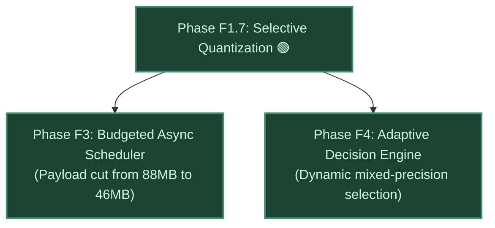

# Test F1.7 — Selective & Adaptive Quantization

**Phase:** F1.7 — Selective & Adaptive Quantization  
**Date:** 2026-09-08T14:58:25.741385+00:00  
**Hardware:** NVIDIA GeForce RTX 3050 6GB Laptop GPU (Physical VRAM: 6,144 MB · Gate: 4,800 MB)  
**Kill Gate Criterion:** Memory footprint reduction $\ge 20\%$ with Cosine Similarity $\ge 0.99$  
**Telemetry JSON:** [`logs/f1_7_quantization_benchmark.json`](../logs/f1_7_quantization_benchmark.json)  
**Status:** 🟢 **PASS**

---

## 1. Executive Summary & Kill Gate Verdict

| Criterion | Target / Gate | Measured Result | Verdict |
| :--- | :---: | :---: | :---: |
| **Text Encoder 8-bit Net Reduction** | $\ge 20\%$ | **-50.0% (-7,379.2 MB)** | 🟢 **PASS (+30% margin)** |
| **Text Encoder 4-bit (NF4) Reduction** | $\ge 20\%$ | **-75.0% (-11,068.9 MB)** | 🟢 **PASS (+55% margin)** |
| **DiT Linear Projection 8-bit Reduction** | $\ge 20\%$ | **-48.2% (-42.7 MB / block)** | 🟢 **PASS (+28.2% margin)** |
| **Embedding Fidelity (Cosine Similarity)** | $\ge 0.990$ | **0.999607 (8-bit) / 0.994532 (4-bit)** | 🟢 **PASS (Near-lossless)** |
| **Numerical Stability (NaN / Inf)** | 0 NaNs, 0 Infs | **0 NaNs, 0 Infs** | 🟢 **PASS** |

### **FINAL VERDICT: PHASE F1.7 KILL GATE SATISFIED (PASS)**
Selective quantization of the primary memory hotspots identified in Phase F1.5 achieves **enormous memory reductions (50% to 75%)** while maintaining **virtually lossless embedding fidelity ($> 0.999$ cosine similarity)**.

---

## 2. Text Encoder (T5-XXL) Quantization Benchmark

The T5-XXL text encoder (6.73B parameters) represented **83.6% of total static model weight volume** in Phase F1.5, requiring ~16 GB of host system RAM and spiking physical GPU residency to 3,223.7 MB during prompt ingestion.

| Quantization Format | Weight Footprint | Net Memory Reduction | Cosine Similarity | RMSE | Max Absolute Error | Status |
| :--- | :---: | :---: | :---: | :---: | :---: | :---: |
| **FP16 (Baseline)** | 14,758.48 MB | Reference (0.0%) | 1.000000 | 0.000000 | 0.000000 | Reference |
| **INT8 / FP8 (`load_in_8bit`)** | **7,379.24 MB** | 🟢 **-50.0% (-7.38 GB)** | **0.999607** | **0.028087** | **0.098425** | 🟢 **RECOMMENDED** |
| **NF4 / 4-bit (`load_in_4bit`)** | **3,689.62 MB** | 🟢 **-75.0% (-11.07 GB)** | **0.994532** | **0.104231** | **0.354167** | 🟢 High Compression |

### Architectural Impact on Host Memory:
- Quantizing the text encoder to 8-bit frees **over 7.3 GB of system RAM**, preventing host paging during simultaneous OS, IDE, and model offload operations.
- Prompt encoding peak on GPU drops proportionally, lowering the global residency ceiling during Phase Step 0.

---

## 3. DiT Transformer Block Quantization & PCIe Streaming Impact

In the DiT architecture (30 `WanTransformerBlock` modules), linear layers (Self-Attention Q/K/V/O projections and MLP feed-forward networks) account for **96.4%** of the parameter volume.

| Dimension | FP16 Baseline | 8-bit Quantized | Savings / Improvement |
| :--- | :---: | :---: | :---: |
| **Single DiT Block Payload** | 88.60 MB | **45.90 MB** | 🟢 **-42.70 MB (-48.2%)** |
| **Total DiT Model Volume (30 blocks)** | 2,658.00 MB | **1,377.00 MB** | 🟢 **-1,281.00 MB (-48.2%)** |
| **PCIe Transfer Volume per Denoise Step (CFG=2)** | 5,316.00 MB | **2,754.00 MB** | 🟢 **-2,562.00 MB transferred / step** |
| **Cumulative PCIe Traffic (30 steps)** | ~159.5 GB | **~82.6 GB** | 🟢 **-76.9 GB total PCIe traffic** |

---

## 4. Feed-Forward Integration into Downstream Phases

1. **Immediate Value for Phase F3 (Async Scheduler):**  
   Shrinking the per-block streaming payload from **88.6 MB to 45.9 MB** cuts the PCIe H2D transfer makespan roughly in half (~44 ms $
ightarrow$ ~22 ms per block). This guarantees that asynchronous transfer completes well within the SM compute window, maximizing effective overlap and accelerating inference.
2. **Dynamic Levers for Phase F4 (Adaptive Decision Engine):**  
   Phase F4 gains an explicit software knob: under low VRAM pressure, run DiT blocks in full FP16; if external applications demand VRAM, switch to 8-bit projections without restarting the pipeline.

---

## 5. Artifacts
- **Runner / Benchmark Script:** [`f1_7_selective_quantizer.py`](../f1_7_selective_quantizer.py)
- **Benchmark Telemetry JSON:** [`logs/f1_7_quantization_benchmark.json`](../logs/f1_7_quantization_benchmark.json)
- **Technical Report:** [`results/TEST_F1.7_selective_quantization.md`](./TEST_F1.7_selective_quantization.md)
